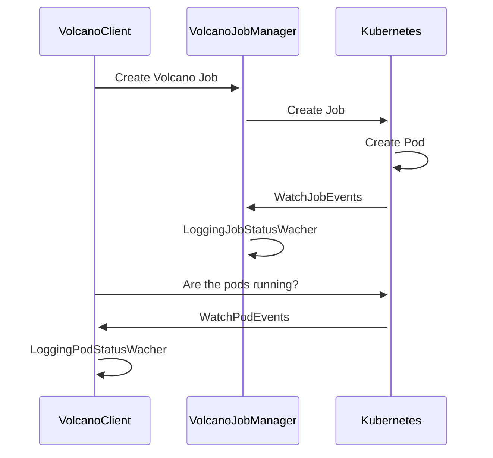
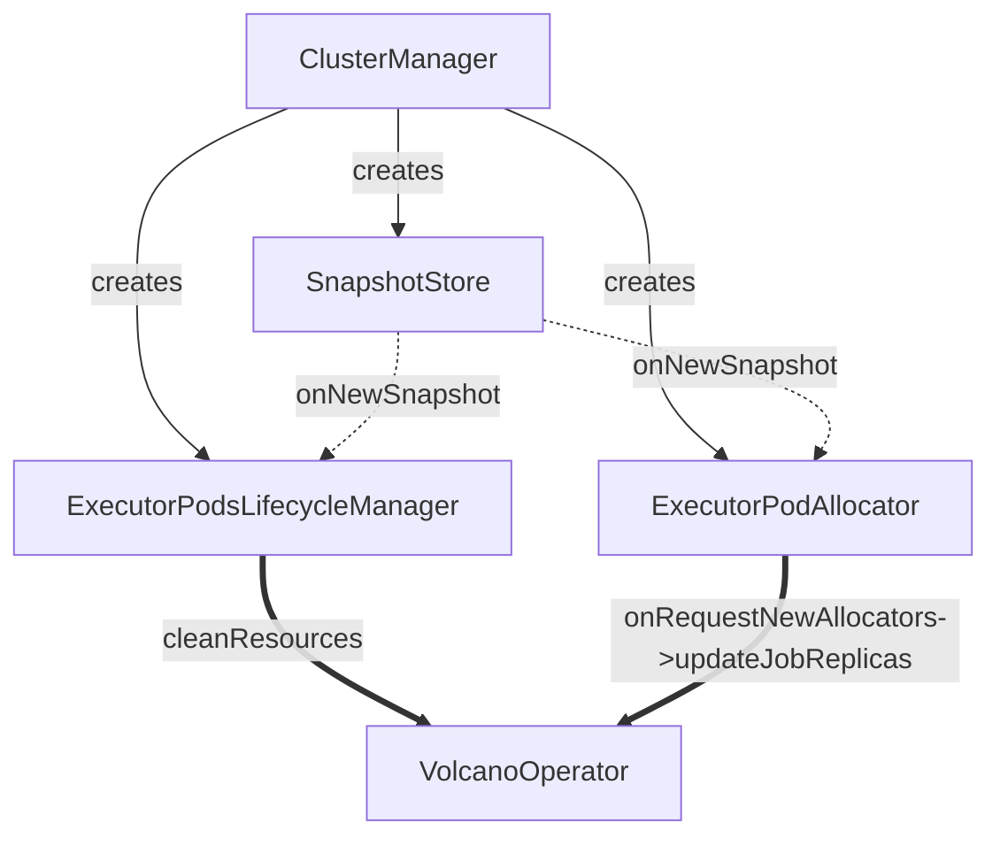

# Architecture


# Job and Pod lifecycle


spark-submit needs three different kinds of watchers:

 - driver watcher (LoggingPodStatusWatcher)
    information:
     - Is the watcher running or not
   
 - executors watcher (ExecutorPodsLifecycleManager)
   information:
    - What is the pod doing?
    
 - volcano job queue watcher (have to build ourselves)
   note: This the only object interact with
   information:
    - Can you start your job?
```
Job{
	Name = spark-u7ys7g8a
	Spec = JobSpec{
		tasks = [TaskSpec{
			name = "driver"
			replica = 1
			template = PodTemplate{ image=spark-driver }
		}, TaskSpec{
			name = "executor"
			replicate = X
			template = PodTemplate{ image=spark-executor }
		}]
	}
}
PodList{
    Pod{
        Name = {JOB_NAME}-driver-1
        Controlled By = {JOB_NAME}
    }, Pod{
        Name = {JOB_NAME}-executor-0
        Controlled By = {JOB_NAME}
    }
}
```


### Executor creation

