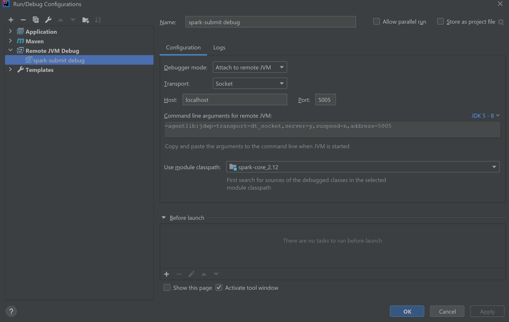

Set up and Debug Spark-k8s in IntelliJ & Minikube
-------------------------------------------------

Check out tag 3.1.1 from source:

```bash
git clone -b v3.1.1 --single-branch https://github.com/apache/spark.git
```

* Download and install Apache MAVEN (3.6.3), JDK 8 and Scala 2.12.13.

* Add the ``JAVA_HOME`` env var to point to the root of JDK.
* Add ``MAVEN_OPTS`` env var as ``"-Xmx6g -Xms6g -Dmaven.artifact.threads=20 -XX:ReservedCodeCacheSize=2g"``
* Add ``$JAVA_HOME/bin``, ``$MVN_HOME/bin`` and ``$SCALA_HOME/bin`` to ``PATH``.
* Run ``mvn compile`` in the root of the Spark project.
* Open the root directory in IntelliJ. IntellJ should be able to compile the entire project successfully.

## Hadoop

You'll also need Hadoop. On Windows, clone winutils.exe from github to a separate (i.e. outside spark)
directory.

```bash
git clone https://github.com/cdarlint/winutils.git
```

Set ``HADOOP_HOME`` env var to the Hadoop version specific root directory (<install_dir>\hadoop-3.2.1) and
add ``$HADOOP_HOME/bin`` to ``PATH``.

## Spark Distribution

We will also need to use the binary distribution of the same version of Spark from
https://archive.apache.org/dist/spark/spark-3.1.1/spark-3.1.1-bin-hadoop3.2.tgz

This is required to

* Build the spark driver dockerfile and publish it in minikube's docker registry
* Avoid re-compiling entire spark codebase on every commit.

Unpack this locally and set the ``SPARK_HOME`` env var to the root of the directory.

## Minikube

Start Minikube with at least 3 CPUs and 4g memory using the docker driver.

```bash
minikube start --cpus 3 --memory 4096
```

Get the cluster URL. We will need to specify it with ``spark-submit``.

```bash
kubectl cluster-info
Kubernetes master is running at k8s://127.0.0.1:58323
```

Next we need to build the spark driver image and then push this image to minikube's docker registry, otherwise the Spark-k8s plugin will
not be able to download it when ``spark-submit`` is called. For this, we need to set the docker context to
point to Minikube's docker daemon.

**Windows**

```bash
@FOR /f "tokens=*" %i IN ('minikube -p minikube docker-env') DO @%i
```

**Linux**

```bash
eval $(minikube docker-env)
```

Build the spark driver docker image:

```bash
docker build -t spark:latest -f kubernetes/dockerfiles/spark/Dockerfile .
```

# IntelliJ Setup

* Create a Remote Debug Configuration in IntelliJ like the screenshot below.



When you make a change in a Spark module, package only that module as a jar and replace the matching
jar in ``$SPARK_HOME\jars`` in the binary distribution.

* Configure the JVM process running spark-submit to listen to the intellij debugger:

```bash
export SPARK_SUBMIT_OPTS=-agentlib:jdwp=transport=dt_socket,server=y,suspend=y,address=5005
```

**Debug Driver**: Instead of ``SPARK_SUBMIT_OPTS``, specify the debug string as
``--conf "spark.driver.extraJavaOptions=<debug_args>`` in the ``spark-submit`` call.

**Debug Executor**: Instead of ``SPARK_SUBMIT_OPTS``, specify the debug string as
``--conf "spark.executor.extraJavaOptions=<debug_args>`` in the ``spark-submit`` call.

## Execute spark-submit

cd to ``$SPARK_HOME`` (the binary distribution) and execute ``spark-submit``:

```bash
bin/spark-submit --master k8s://127.0.0.1:58323 \
  --deploy-mode cluster \
  --name spark-pi \
  --class org.apache.spark.examples.SparkPi \
  --conf spark.executor.instances=2 \
  --conf spark.kubernetes.container.image=spark:latest \
  --conf spark.kubernetes.file.upload.path=examples \
local:///opt/spark/examples/jars/spark-examples_2.12-3.1.1.jar
```

Again, change the master url for your own Minikube setup.

Now, ``spark-submit`` will wait for the debugger in IntelliJ to connect. Start a new debugging session and step through
specified breakpoints (``org.apache.spark.deploy.SparkSubmit.scala`` is a good starting point).

## References

* **Technical overview of Spark on Kubernetes**: https://spark.apache.org/docs/latest/running-on-kubernetes.html
* **Spark Build Notes: https**://spark.apache.org/docs/latest/building-spark.html
* **Spark IntelliJ Setup Notes**:  https://spark.apache.org/developer-tools.html
* **Minikube Registry**: https://minikube.sigs.k8s.io/docs/handbook/registry/
